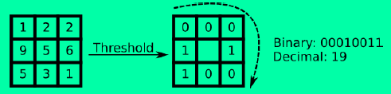
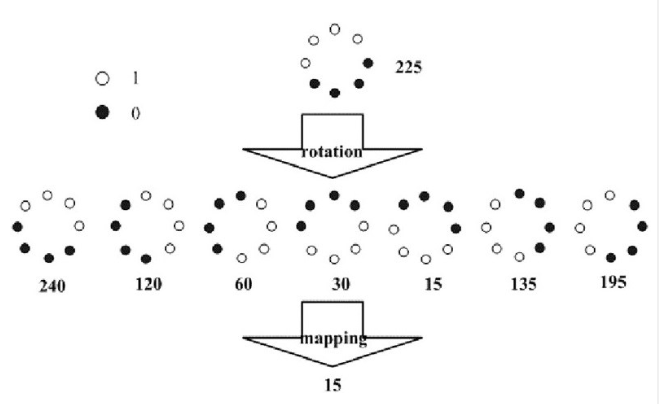

# 图像特征提取方法

## LBP方法

Local Binary Pattern，局部二值化模式，具有灰度不变性和旋转不变性，计算简单，常用在人脸检测上。

### 计算方式

原始LBP算子为3x3大小的kernel，以被3x3领域覆盖的中心像素值作为阈值，从左到右，从上到下，以此填充0（小于阈值）和1（大于阈值），然后按顺时针读取二进制值作为中心元素的新的像素值。如下图示意：



OpenCV中原始代码：通过位运算提高运算速度获取中心元素的值。

```
template <typename _tp>
void getOriginLBPFeature(InputArray _src,OutputArray _dst)
{
    Mat src = _src.getMat();
    _dst.create(src.rows-2,src.cols-2,CV_8UC1);
    Mat dst = _dst.getMat();
    dst.setTo(0);
    for(int i=1;i<src.rows-1;i++)
    {
        for(int j=1;j<src.cols-1;j++)
        {
            _tp center = src.at<_tp>(i,j);
            unsigned char lbpCode = 0;
            lbpCode |= (src.at<_tp>(i-1,j-1) > center) << 7;
            lbpCode |= (src.at<_tp>(i-1,j  ) > center) << 6;
            lbpCode |= (src.at<_tp>(i-1,j+1) > center) << 5;
            lbpCode |= (src.at<_tp>(i  ,j+1) > center) << 4;
            lbpCode |= (src.at<_tp>(i+1,j+1) > center) << 3;
            lbpCode |= (src.at<_tp>(i+1,j  ) > center) << 2;
            lbpCode |= (src.at<_tp>(i+1,j-1) > center) << 1;
            lbpCode |= (src.at<_tp>(i  ,j-1) > center) << 0;
            dst.at<uchar>(i-1,j-1) = lbpCode;
        }
    }

}
```

### 改进

3x3正方形的kernel不满足灰度不变性和旋转不变性，原因在于原始的LBP算子只能覆盖一个固定的正方形区域，当尺寸改变时不能正确地反应像素点周围的纹理信息。为了适应不同尺度的纹理特征，将3x3正方形区域修改成圆形领域，对圆形领域内的点进行采样获取，便具备灰度不变性，对于光照有很强的鲁棒性。但此时还不具备旋转不变性，需要通过旋转LBP圆形领域获取不同的LBP特征值，选取最小值作为中心像素值即可，这样无论如何旋转图片，取得LBP特征值总是一样的。



还有其他LBP模式，如Uniform Pattern LBP特征等等，详情可看[这篇文章](<https://blog.csdn.net/quincuntial/article/details/50541815>)

