# 大型网站技术架构--读书笔记

## 第一章

大型互联网系统特点：

- 高并发，大流量
- 高可用
- 海量数据
- 用户分布广发，网络情况复杂
- 安全环境恶劣
- 需求快速变更，发布频繁
- 渐进式发展

大型网站架构发展过程：

+ 初始阶段：

  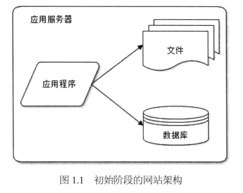

+ 紧接着，应用服务和数据服务分离

  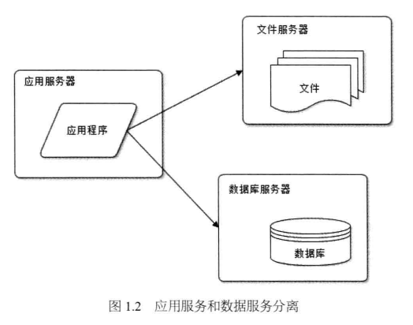

- 加入缓存：本地缓存和分布式缓存服务器上的远程缓存

  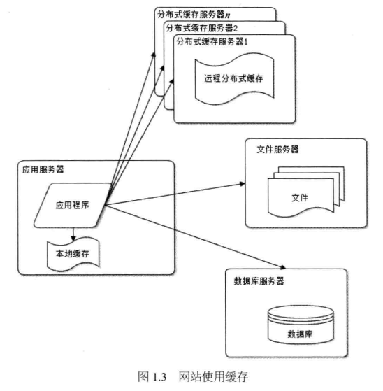

  - 使用集群方式改善网站的并发处理能力和处理海量数据问题

    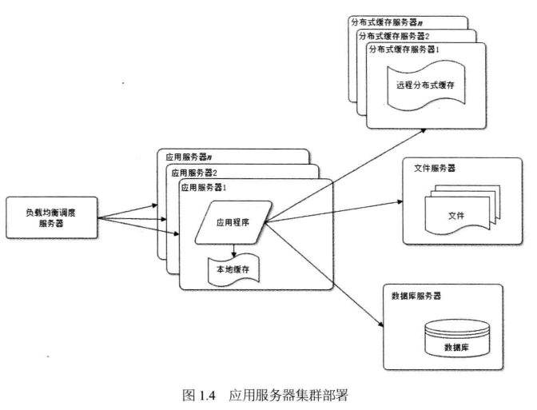

  - 数据库读写分离，改善数据库负载能力

    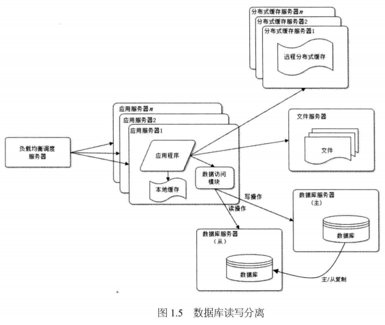

  - 使用反向代理和CDN加速网站访问

    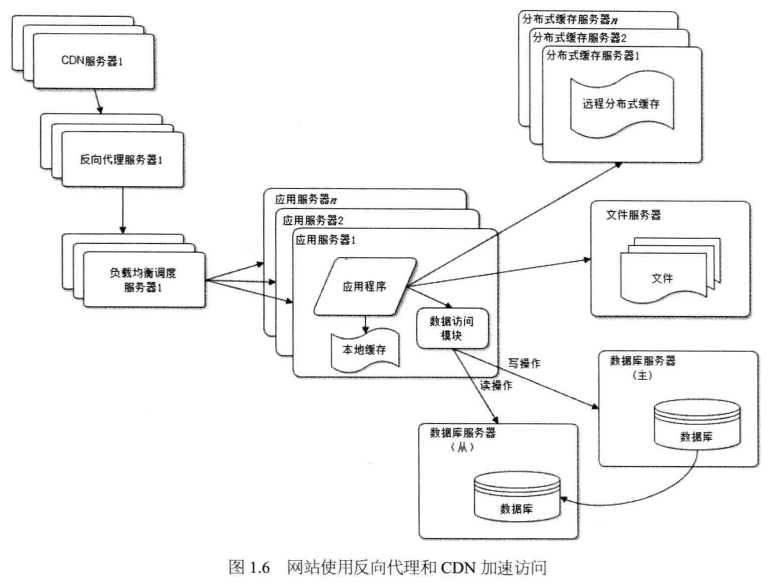

  - 使用分布式文件系统和分布式数据库系统

    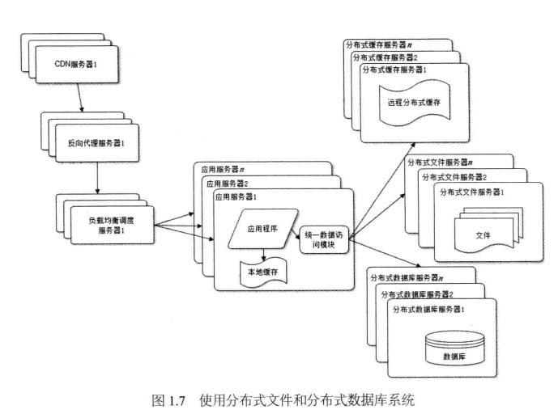

  - 使用NoSQL和搜索引擎

    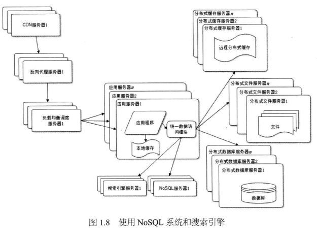

  - 业务差分，拆分成不同的应用，每个应用独立部署

    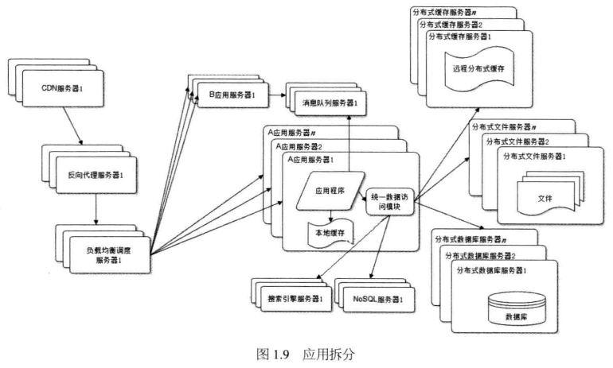

  - 分布式服务

    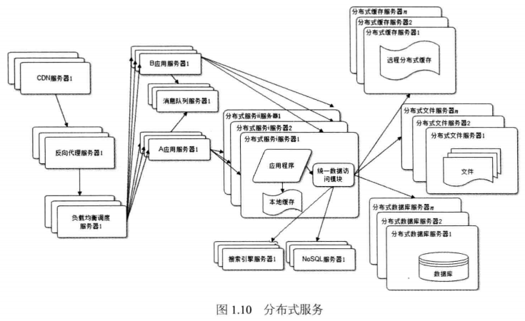

## 第二章：大型网站架构模式

### 网站架构模式

- 分层：横向切分，应用软件可以分成应用层，服务层和数据层，各层之间相互依赖和调用

  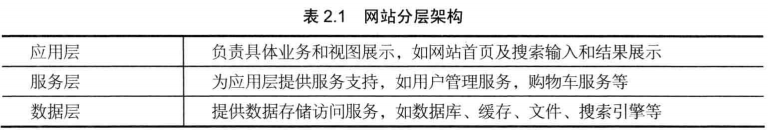

  （应用层还可以继续切分为视图层和业务逻辑层，服务层可以细分成数据接口层和逻辑处理层）

- 分割：纵向切分，将不同功能和服务分割开来，便于软件的开发和维护，便于不同模块分布式部署，提高网站的并发处理能力和功能扩展。

- 分布式：分层和分割的一个主要目的是为了切分之后便于分布式部署，将不同模块部署在不同的服务器上，通过远程调用协同工作。分布式问题：1.必须通过网络，可能对性能造成比较严重的影响；2.服务器越多，宕机的概率也越大哦；3.数据一致性问题；4.开发管理维护比较困难。一般有如下几种分布式方案：

  - 分布式应用和服务
  - 分布式静态资源
  - 分布式数据和存储
  - 分布式计算

- 集群：多台服务器部署相同应用构成一个集群，通过负载均衡设备共同对外提供服务，提供更好的并发特性和提高系统给的可用性。

- 缓存：将数据存发在距离计算最近的位置以加快处理速度。用在热点数据上。

  - CDN：内容分发网络，部署在距离终端用户很近网络服务商，可以就近以最快速度返回静态资源给用户
  - 反向代理：属于网站前端架构，请求首先访问到反向代理服务器，如果有其需要的静态资源直接返回，无需转发给应用服务器
  - 本地缓存：在应用服务器本地缓存热点数据，而无需访问数据库
  - 分布式缓存：专门的机器缓存热点数据

- 异步：通过异步降低软件的耦合性，例如使用异步消息队列：

  - 提高系统可用性
  - 加快网站响应速度
  - 消除并发访问高峰

- 冗余：服务器的冗余备份，实现服务高可用。一台宕机，可以将服务和数据转移到其他机器上。

- 自动化：发布过程自动化：自动化代码管理，自动化测试，自动化安全检测，自动化部署。自动化监控，报警，失效转移和恢复，自动化降级，自动化分配资源。

- 安全

## 第三章：大型网站核心架构要素

软件架构的五个核心要素：

1. 性能

2. 可用性
3. 伸缩性
4. 扩展性
5. 安全性