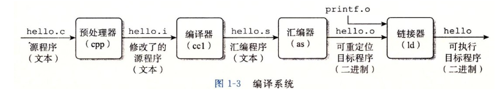
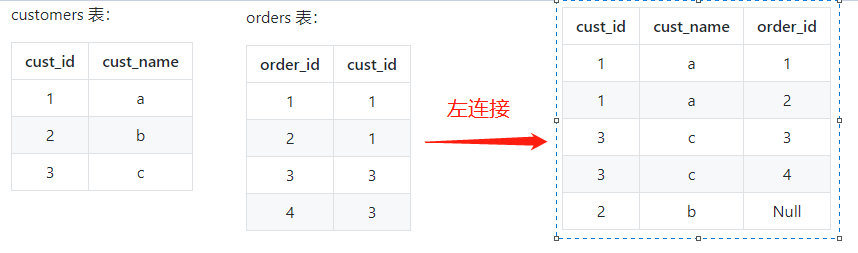
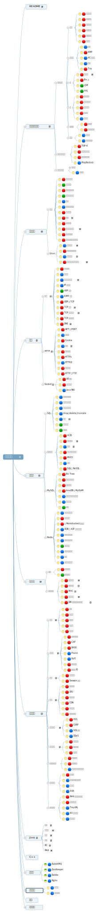

# 2. 操作系统

## 2.1 基础

- ★★★ 进程与线程的本质区别、以及各自的使用场景。

  - 进程：是**资源分配**的基本单位，进程控制块（PCB）描述进程的基本信息和运行状态（创建和撤销进程都是对PCB进行操作）
  - 线程：是**独立调度**的基本单位
  - 两者区别：
    - 进程是系统分配资源的基本单位，而线程不拥有资源，但可以访问隶属进程的资源
    - 线程是独立调度的基本单位，同一进程内的线程切换不会引起进程的切换
    - 进程切换开销涉及当前进程CPU环境保存和新调度进程CPU环境设置（内存空间，I/O设备等等），而线程切换开销较小，只需要保存和设置少量寄存器内容
    - 线程之间可以通过直接读写同一进程数据进行通信，但是进程间通信需要借助IPC

- ★☆☆ 进程状态。

  

  就绪状态，运行状态和阻塞状态

  ​	

- ★★★ 进程调度算法的特点以及使用场景。

  - 批处理系统：目标保证吞吐量和周转时间
    - 先来先服务（FCFS）：有利于长作业运行
    - 短作业优先（SJF）：有可能饿死长作业
    - 最短剩余时间优先（SRTN）：按照最短剩余时间排序
  - 交互式系统：强调快速响应
    - 时间片轮转：时间片的大小决定该调度的效率，过大无法保证实时性；过小进程切换过于频繁
    - 优先级调度：按照进程优先度进行调度，对于低优先度，可以增加随时间增大增加等待进程的优先级
    - 多级反馈队列：多级队列是为这种需要连续执行多个时间片的进程考虑，它设置了多个队列，每个队列时间片大小都不同，另外每个队列优先度均不同，综合前两种方法
  - 实时系统：要求在一个确定时间内得到响应，分硬实时（绝对的截止时间）和软实时（允许一定的超时）

- ★☆☆ 线程实现的方式。

  - 继承Thread类，重写run方法
  - 实现Runnable接口，重写run方法，然后传进Thread中
  - 通过Callable和FutrueTask创建可带返回值的线程
  - 通过线程池

- ★★☆ 协程的作用。

  实现函数的分段式执行。就是一个函数的执行可以主动放弃CPU的控制权，先挂起，让其他的函数先执行，然后在返回，从上次执行结束的地方继续执行。本质上仍然是**一个线程在执行**。

- ★★☆ 常见进程同步问题。

  - 生产者和消费者问题
  - 读者-写着问题：其实和生产者和消费者问题类似
  - 哲学家就餐问题：防止死锁问题的条件必须同时拿起左右两根筷子和必须有不进餐才可以

- ★★★ 进程通信方法的特点以及使用场景。

  - **匿名管道**：使用pipe函数创建，只在父子进程中使用，半双工通信
  - **命名管道（FIFO）**：去除父子线程使用的限制，常用在客户和服务器应用程序中作为汇聚点，在客户端进程和服务端进程进程数据传递
  - **消息队列**：1. 独立于读写进程的存在，避免了像管道那样打开和关闭的困难；2. 避免了FIFO的同步阻塞问题，不需要进程自己提供同步方法；3. 读进程根据消息类型有选择接收消息
  - **信号量**： 其实就是个计数器，限制过多进程对共享数据对象的访问
  - **共享存储**：多个进程可以将同一个文件映射到它们的地址空间从而实现共享内存，需要使用信号量用来同步对共享存储的访问。
  - **套接字**：Socket通信，现在最常用的一种方式，允许不同机器间进程通信

- ★★★ 死锁必要条件、解决死锁策略，能写出和分析死锁的代码，能说明在数据库管理系统或者 Java 中如何解决死锁。

  - 必要条件：
    - **互斥**：每个资源要么已经分配给了一个进程，要么就是可用的。
    - **占有和等待**：已经得到了某个资源的进程可以再请求新的资源。
    - **不可抢占**：已经分配给一个进程的资源不能强制性地被抢占，它只能被占有它的进程显式地释放。
    - **环路等待**：有两个或者两个以上的进程组成一条环路，该环路中的每个进程都在等待下一个进程所占有的资源。
  - 解决死锁策略：
    - 鸵鸟策略：忽略死锁，操作系统常采用这种策略，可以获得更高性能
    - 死锁检测：每次分配资源之前，通过资源分配有向图判断是否存在有环，检测到死锁发生
    - 死锁恢复：1. 抢占恢复，破坏不可抢占的条件；2.回滚恢复，数据库常用；3.杀死进程恢复
    - 死锁预防：破环四个必要条件
    - 死锁避免：银行家算法（和死锁检测有点像）

- ★★★ 虚拟内存的作用，分页系统实现虚拟内存原理。

  虚拟内存的目的是**为了让物理内存扩充成更大的逻辑内存**，从而让程序获得**更多的可用内存**。

  为了更好的管理内存，操作系统将内存抽象成地址空间。每个程序**拥有自己的地址空间**，这个地址空间被**分割成多个块**，每一块称为一页。这些页被映射到物理内存，但**不需要映射到连续的物理内存**，也**不需要所有页都必须在物理内存中**。当程序引用到不在物理内存中的页时，由硬件执行必要的映射，将缺失的部分装入物理内存并重新执行失败的指令。

- ★★★ 页面置换算法的原理，特别是 LRU 的实现原理，最好能手写，再说明它在 Redis 等作为缓存置换算法。

  在程序运行过程中，如果要访问的页面不在内存中，就发生缺页中断从而将该页调入内存中。此时如果内存已无空闲空间，系统必须从内存中调出一个页面到磁盘对换区中来腾出空间。

  - 最佳置换算法（OPT）：所选择的被换出的页面将是最长时间内不再被访问，通常可以保证获得最低的缺页率。

  - **最近最久未使用（LRU）**：根据过去使用页面的情况，LRU 将最近最久未使用的页面换出。实现 LRU，需要在内存中维护一个所有页面的链表。当一个页面被访问时，将这个页面移到链表表头。这样就能保证链表表尾的页面是最近最久未访问的。因为每次访问都需要**更新链表**，因此这种方式实现的 LRU 代价很高。

    

    ```java
    /*
    使用LinkedHashMap实现LRU
    */
    public class LRUCache<K, V> extends LinkedHashMap<K, V> {
        private final int MAX_CACHE_SIZE;
    
        public LRUCache(int cacheSize) {
            //设置true，即根据访问顺序来排序
            super((int) Math.ceil(cacheSize / 0.75) + 1, 0.75f, true);
            MAX_CACHE_SIZE = cacheSize;
        }
    
        @Override
        protected boolean removeEldestEntry(Map.Entry eldest) {
            return size() > MAX_CACHE_SIZE;
        }
    
        @Override
        public String toString() {
            StringBuilder sb = new StringBuilder();
            for (Map.Entry<K, V> entry : entrySet()) {
                sb.append(String.format("%s:%s ", entry.getKey(), entry.getValue()));
            }
            return sb.toString();
        }
    }
    ```

    

  - 最近未使用（NRU）：当发生缺页中断时，NRU 算法随机地从类编号最小的非空类中挑选一个页面将它换出。实现较为麻烦和繁琐，需要设置R位和M位

  - 先进先出（FIFO）：该算法会将那些经常被访问的页面也被换出，从而使缺页率升高

  - 第二次算法：当页面被访问 (读或写) 时设置该页面的 R 位为 1。需要替换的时候，检查最老页面的 R 位。如果 R 位是 0，那么这个页面既老又没有被使用，可以立刻置换掉；如果是 1，就将 R 位清 0，并把该页面放到链表的尾端，修改它的装入时间使它就像刚装入的一样，然后继续从链表的头部开始搜索。

  - 时钟算法：将第二次算法的链表改成环形链表

- ★★★ 比较分页与分段的区别。

  - 分页技术，也就是将地址空间划分成固定大小的页，每一页再与内存进行映射。
  - 分段技术，把每个表分成段，一个段构成一个独立的地址空间。每个段的长度可以不同，并且可以动态增长。解决分页使用一维空间时，动态增长造成覆盖问题。
  - 区别：
    - 对程序员的透明性：分页透明，但是分段需要程序员显示划分每个段。
    - 地址空间的维度：分页是一维地址空间，分段是二维的。
    - 大小是否可以改变：页的大小不可变，段的大小可以动态改变。
    - 出现的原因：分页主要用于实现虚拟内存，从而获得更大的地址空间；分段主要是为了使程序和数据可以被划分为**逻辑上独立的地址空间**并且**有助于共享和保护**。

- ★★★ 分析静态链接的不足，以及动态链接的特点。

  

  - 预处理阶段：处理以 # 开头的预处理命令；
  - 编译阶段：翻译成**汇编文件**；
  - 汇编阶段：将汇编文件翻译成**可重定向目标文件**；
  - 链接阶段：将可重定向目标文件和 printf.o 等单独预编译好的目标文件进行合并，得到最终的可执行目标文件。

  静态库有以下两个问题：

  - 当静态库**更新时**那么**整个程序都要重新进行链接**；
  - 对于 printf 这种标准函数库，如果每个程序都要有代码，这会**极大浪费资源**。

  动态链接借助共享库（Linux上.so文件，Windows上.dll文件），解决静态链接这两个问题：

  - 在给定的文件系统中一个库只有一个文件，所有引用该库的可执行目标文件都共享这个文件，它不会**被复制到引用它的可执行文件**中；
  - 在**内存中**，一个共享库的 .text 节（已编译程序的机器代码）的一个副本**可以被不同的正在运行的进程共享**。

## 2.2 Linux

- ★★☆ 文件系统的原理，特别是 inode 和 block。数据恢复原理。

  一个分区通常只能格式化为一个文件系统，但是**磁盘阵列等技术**可以将一个分区格式化为多个文件系统。

  文件系统的组成：

  - inode：一个文件占用一个 inode，**记录文件的属性**，同时记录此文件的内容所在的 **block 编号**；
  - block：记录文件内容，文件太大会占用多个block（磁盘碎片：是指一个文件内容所在的block过于分散）
  - superblock：记录文件系统的整体信息，包括 inode 和 block 的总量、使用量、剩余量，以及文件系统的格式与相关信息等；
  - block bitmap：记录 block 是否被使用的位域。

- ★★★ 硬链接与软链接的区别。

  ```shell
  # ln [-sf] source_filename dist_filename
  -s ：默认是 hard link，加 -s 为 symbolic link
  -f ：如果目标文件存在时，先删除目标文件
  ```

  

  - 硬链接（实体链接）：直接指向源文件的inode，删除任意条目，文件仍然存在记录着，只要引用数量不为0，**限制**是不能跨越文件系统，不能对目录进行链接
  - 软链接（符号链接）：软连接是指向源文件，但源文件删除，软连接就打不开了，可以对目录进行链接。

- ★★☆ 能够使用常用的命令，比如 cat 文件内容查看、find 搜索文件，以及 cut、sort 等管线命令。了解 grep 和 awk 的作用。

- ★★★ 僵尸进程与孤儿进程的区别，从 SIGCHLD 分析产生僵尸进程的原因。

  - SIGCHLD：当一个子进程改变了它的状态时（停止运行，继续运行或者退出），有两件事会发生在父进程中：

    - 得到 SIGCHLD 信号；
    - waitpid() 或者 wait() 调用会返回。

    其中子进程发送的 SIGCHLD 信号包含了子进程的信息，比如进程 ID、进程状态、进程使用 CPU 的时间等。在子进程退出时，它的进程描述符不会立即释放，这是为了让父进程得到子进程信息，父进程通过 wait() 和 waitpid() 来获得一个已经退出的子进程的信息。

    

  - 孤儿进程：是指父进程退出时，其子进程仍在运行，将成为孤儿进程，被init进程（pid为1）收养，由init进程对它们进行完成状态收集工作，因此孤儿进程不会对系统造成伤害

  - 僵尸进程：是指子进程退出，其进程描述符没有被父进程调用wait(), waitpid()方法释放，仍然保存在系统，称之为僵尸进程。进程号有限，如果产生大量僵尸进程，可能会导致系统不能产生新的进程。**解决办法：可以将父进程杀死，使其成为孤儿进程，被init进程回收，结束僵尸进程。**


☁️

# 3. 网络

## 3.1 基础

- ★★★ 各层协议的作用，以及 TCP/IP 协议的特点。

  - **应用层** ：**为特定应用程序提供数据传输服务**，例如 HTTP、DNS 等协议。数据单位为报文。
  - **传输层** ：为**进程**提供通用数据传输服务。由于应用层协议很多，定义通用的传输层协议就可以支持不断增多的应用层协议。运输层包括两种协议：传输控制协议 TCP，提供面向连接、可靠的数据传输服务，数据单位为报文段；用户数据报协议 UDP，提供无连接、尽最大努力的数据传输服务，数据单位为用户数据报。TCP 主要提供完整性服务，UDP 主要提供及时性服务。
  - **网络层** ：为**主机**提供数据传输服务。而传输层协议是为主机中的进程提供数据传输服务。网络层把传输层传递下来的报文段或者用户数据报封装成分组。
  - **数据链路层** ：网络层针对的还是主机之间的数据传输服务，而主机之间可以有很多链路，**链路层协议就是为同一链路的主机提供数据传输服务**。数据链路层把网络层传下来的分组**封装成帧**。
  - **物理层** ：考虑的是怎样在传输媒体上传输数据比特流，而不是指具体的传输媒体。物理层的作用是**尽可能屏蔽传输媒体和通信手段的差异**，使数据链路层感觉不到这些差异。

  TCP/IP不严格遵循OSI分层概念，应用层可能直接使用IP层或者网络接口层（数据链路层和物理层合并为一个网络接口层），如下图所示：

  

  

- ★★☆ 以太网的特点，以及帧结构。

  以太网是一种**星型拓扑结构**局域网。早期使用集线器进行连接，集线器是一种物理层设备， **作用于比特**而不是帧，当一个比特到达接口时，集线器重新生成这个比特，并将其能量强度放大，从而扩大网络的传输距离，之后再将这个比特发送到其它所有接口。如果集线器**同时收到两个**不同接口的帧，那么就发生了**碰撞**。现用交换机替换集线器，根据MAC地址进行转发不会发生碰撞。

  以太网帧格式：

  - **类型** ：标记上层使用的协议；
  - **数据** ：长度在 46-1500 之间，如果太小则需要填充；
  - **FCS** ：帧检验序列，使用的是 CRC 检验方法；

  

- ★★☆ 集线器、交换机、路由器的作用，以及所属的网络层。

  - 集线器：物理层设备，进行比特转发
  - 交换机：数据链路层设备，进行数据帧转发，具有自学习能力，学习的是交换表的内容，交换表中存储着 MAC 地址到接口的映射。
  - 路由器：网路层设备，进行路由选择和分组转发的功能

- ★★☆ IP 数据数据报常见字段的作用。

  

  - **版本** : 有 4（IPv4）和 6（IPv6）两个值；
  - **首部长度** : 占 4 位，因此最大值为 15。值为 1 表示的是 1 个 32 位字的长度，也就是 4 字节。因为首部固定长度为 20 字节，因此该值最小为 5。如果可选字段的长度不是 4 字节的整数倍，就用尾部的填充部分来填充。
  - **区分服务** : 用来获得更好的服务，一般情况下不使用。
  - **总长度** : 包括首部长度和数据部分长度。
  - **生存时间** ：TTL，它的存在是为了防止无法交付的数据报在互联网中不断兜圈子。以路由器跳数为单位，当 TTL 为 0 时就丢弃数据报。
  - **协议** ：指出携带的数据应该上交给哪个协议进行处理，例如 ICMP、TCP、UDP 等。
  - **首部检验和** ：因为数据报每经过一个路由器，都要重新计算检验和，因此检验和不包含数据部分可以减少计算的工作量。
  - **标识** : 在数据报长度过长从而发生分片的情况下，相同数据报的不同分片具有相同的标识符。
  - **片偏移** : 和标识符一起，用于发生分片的情况。片偏移的单位为 8 字节。

- ★☆☆ ARP 协议的作用，以及维护 ARP 缓存的过程。

  ARP协议根据IP地址获取MAC，如果ARP高速缓存中没有对应IP-MAC映射，则通过广播方式发送ARP请求查找，找到后并将该映射写入高速缓存中。

- ★★☆ ICMP 报文种类以及作用；和 IP 数据报的关系；Ping 和 Traceroute 的具体原理。

  ICMP 是为了更有效地转发 IP 数据报和提高交付成功的机会。它**封装在 IP 数据报**中，但是**不属于高层协议**。

  - 差错报告报文
  - 询问报文

  

  - Ping：用来测试连通性，通过向目的主机发送 ICMP Echo 请求报文，目的主机收到之后会发送 Echo 回答报文。Ping 会根据时间和成功响应的次数估算出数据包往返时间以及丢包率。
  - Tracerrouter：用来跟踪一个分组从源点到终点的路径，通过发送的 IP 数据报封装的是无法交付的 UDP 用户数据报，并由目的主机发送终点不可达差错报告报文。

- ★★★ UDP 与 TCP 比较，分析上层协议应该使用 UDP 还是 TCP。

  - 用户数据报协议 UDP（User Datagram Protocol）是无连接的，尽最大可能交付，没有拥塞控制，面向报文（对于应用程序传下来的报文不合并也不拆分，只是添加 UDP 首部），支持一对一、一对多、多对一和多对多的交互通信。
  - 传输控制协议 TCP（Transmission Control Protocol）是面向连接的，提供可靠交付，有流量控制，拥塞控制，提供全双工通信，面向字节流（把应用层传下来的报文看成字节流，把字节流组织成大小不等的数据块），每一条 TCP 连接只能是点对点的（一对一）。

- ★★★ 理解三次握手以及四次挥手具体过程，三次握手的原因、四次挥手原因、TIME_WAIT 的作用。

  **三次握手的原因**

  第三次握手是为了**防止失效的连接请求到达服务器**，让服务器错误打开连接。

  客户端发送的连接请求如果在网络中滞留，那么就会隔很长一段时间才能收到服务器端发回的连接确认。客户端等待一个超时重传时间之后，就会重新请求连接。但是这个滞留的连接请求最后还是会到达服务器，如果不进行三次握手，那么服务器就会打开两个连接。如果有第三次握手，客户端会忽略服务器之后发送的对滞留连接请求的连接确认，不进行第三次握手，因此就不会再次打开连接。

  **四次挥手的原因**

  客户端发送了 FIN 连接释放报文之后，服务器收到了这个报文，就进入了 CLOSE-WAIT 状态。这个状态是为了让服务器端发送还未传送完毕的数据，传送完毕之后，服务器会发送 FIN 连接释放报文。

  **TIME_WAIT**

  客户端接收到服务器端的 FIN 报文后进入此状态，此时并不是直接进入 CLOSED 状态，还需要等待一个时间计时器设置的时间 2MSL。这么做有两个理由：

  - 确保最后一个确认报文能够到达。如果 B 没收到 A 发送来的确认报文，那么就会重新发送连接释放请求报文，A 等待一段时间就是为了处理这种情况的发生。
  - 等待一段时间是为了让本连接持续时间内所产生的所有报文都从网络中消失，使得下一个新的连接不会出现旧的连接请求报文。

  

- ★★★ 可靠传输原理，并设计可靠 UDP 协议。

  TCP 使用**超时重传**来实现可靠传输：如果一个已经发送的报文段在超时时间内没有收到确认，那么就重传这个报文段。

- ★★☆ TCP 拥塞控制的作用，理解具体原理。

  如果网络出现拥塞，分组将会丢失，此时发送方会继续重传，从而导致网络拥塞程度更高。因此当出现拥塞时，应当控制发送方的速率。这一点和流量控制很像，但是出发点不同。**流量控制是为了让接收方能来得及接收**，而**拥塞控制是为了降低整个网络的拥塞程度**。

  > 关于流量控制是为了控制发送方发送速率，保证接收方来得及接收。
  >
  > 接收方发送的确认报文中的窗口字段可以用来控制发送方窗口大小，从而影响发送方的发送速率。将窗口字段设置为 0，则发送方不能发送数据。

- ★★☆ DNS 的端口号；TCP 还是 UDP；作为缓存、负载均衡。

  DNS 是一个**分布式数据库**，提供了**主机名和 IP 地址之间相互转换**的服务。DNS 可以使用 UDP 或者 TCP 进行传输，使用的**端口号都为 53**。大多数情况下 DNS 使用 UDP 进行传输，这就要求域名解析器和域名服务器都必须自己处理超时和重传来保证可靠性。在两种情况下会使用 TCP 进行传输：

  - 如果返回的响应超过的 512 字节（UDP 最大只支持 512 字节的数据）。
  - 区域传送（区域传送是主域名服务器向辅助域名服务器传送变化的那部分数据）。

## 3.2 HTTP

- ★★★ GET 与 POST 比较：作用、参数、安全性、幂等性、可缓存。

  - 作用：GET用于获取资源，POST用于传输实体主体

  - 参数：GET 和 POST 的请求都能**使用额外的参数**，但是 **GET 的参数**是以查询字符串**出现在 URL** 中，而 **POST 的参数**存储在**实体主体**中。不能因为 POST 参数存储在实体主体中就认为它的安全性更高，因为照样可以通过一些抓包工具（Fiddler）查看。

    因为 **URL 只支持 ASCII 码**，因此 GET 的参数中如果存在中文等字符就需要先进行编码。例如 `中文` 会转换为 `%E4%B8%AD%E6%96%87`，而空格会转换为 `%20`。**POST 参考支持标准字符集**。

  - 安全性：取决于**是否会改变服务器状态**，GET方法是安全，POST是不安全，可能会改变服务器状态，比如用户数据存储到数据库。

  - 幂等性：幂等的 HTTP 方法，**同样的请求被执行一次与连续执行多次的效果是一样的**，服务器的状态也是一样的。换句话说就是，幂等方法**不应该具有副作用**（统计用途除外）。GET，HEAD，PUT 和 DELETE 等方法都是幂等的，而 POST 方法不是。

  - 可缓存：要对响应进行缓存，需要满足以下条件：

    - **请求报文的 HTTP 方法本身是可缓存的**，包括 GET 和 HEAD，但是 PUT 和 DELETE 不可缓存，POST 在多数情况下不可缓存的。
    - **响应报文的状态码是可缓存的**，包括：200, 203, 204, 206, 300, 301, 404, 405, 410, 414, and 501。
    - 响应报文的 **Cache-Control 首部字段**没有指定不进行缓存。

- ★★☆ HTTP 状态码。

  | 状态码 | 类别                             | 含义                       |
  | ------ | -------------------------------- | -------------------------- |
  | 1XX    | Informational（信息性状态码）    | 接收的请求正在处理         |
  | 2XX    | Success（成功状态码）            | 请求正常处理完毕           |
  | 3XX    | Redirection（重定向状态码）      | 需要进行附加操作以完成请求 |
  | 4XX    | Client Error（客户端错误状态码） | 服务器无法处理请求         |
  | 5XX    | Server Error（服务器错误状态码） | 服务器处理请求出错         |

- ★★★ Cookie 作用、安全性问题、和 Session 的比较。

  HTTP协议是无状态的，主要是为了让HTTP协议尽量简单，可以处理大量事务，HTTP/1.1引入Cookie**保存状态信息**：

  1. 会话状态管理（如用户登录状态、购物车、游戏分数或其它需要记录的信息）
  2. 个性化设置（如用户自定义设置、主题等）
  3. 浏览器行为跟踪（如跟踪分析用户行为等）

  关于**安全性**：在没有设置secure字段时，Cookie信息可以在请求报文和响应报文的头部字段中看到；此外Cookie保存在本地上，可以别其他网站读取，因此需要设置HttpOnly避免XSS攻击。如今有新的浏览器API允许使用WebStorageAPI和IndexedDB存储数据到本地，逐渐淘汰Cookie。

  **Cookie 与 Session 比较：**

  - Cookie 只能存储 ASCII 码字符串，而 Session 则可以存取任何类型的数据，因此在考虑数据复杂性时首选 Session；
  - Cookie 存储在浏览器中，容易被恶意查看。如果非要将一些隐私数据存在 Cookie 中，可以将 Cookie 值进行加密，然后在服务器进行解密；
  - 对于大型网站，如果用户所有的信息都存储在 Session 中，那么开销是非常大的，因此不建议将所有的用户信息都存储到 Session 中。

- ★★☆ 缓存 的Cache-Control 字段，特别是 Expires 和 max-age 的区别。ETag 验证原理。

  **Cache-Control**：HTTP/1.1中通过这个首部字段控制缓存。

  - no-store：规定不能对请求或响应的任何一部分进行缓存。
  - no-cache：规定缓存服务器需要先向源服务器验证缓存资源的有效性，只有当缓存资源有效才将能使用该缓存对客户端的请求进行响应。
  - private ：规定了将资源作为私有缓存，只能被单独用户所使用，一般存储在用户浏览器中。
  - public ：规定了将资源作为公共缓存，可以被多个用户所使用，一般存储在代理服务器中。
  - max-age指令：出现在**请求报文**中，并且缓存资源的缓存时间小于该指令指定的时间，那么就能接受该缓存；出现在**响应报文**中，表示缓存资源在缓存服务器中保存的时间。

  **Expires 首部字段**也可以用于**告知缓存服务器该资源什么时候会过期**。

  **ETag 首部字段**的含义，它是**资源的唯一标识**，有两种用法：

  - 将缓存资源的 ETag 值放入 If-None-Match 首部，服务器收到该请求后，**判断缓存资源的 ETag 值和资源的最新 ETag 值是否一致**，如果一致则表示缓存资源有效，返回 304 Not Modified。
  - Last-Modified 首部字段也可以用于缓存验证，它包含在源服务器发送的响应报文中，指示源服务器对资源的最后修改时间。但是它是一种弱校验器，因为只能精确到一秒，所以它通常作为 ETag 的备用方案。如果响应首部字段里含有这个信息，客户端可以在后续的请求中带上 If-Modified-Since 来验证缓存。服务器只在所请求的资源在给定的日期时间之后对内容进行过修改的情况下才会将资源返回，状态码为 200 OK。如果请求的资源从那时起未经修改，那么返回一个不带有消息主体的 304 Not Modified 响应。

- ★★★ 长连接与短连接原理以及使用场景，流水线。

- ★★★ HTTP 存在的安全性问题，以及 HTTPs 的加密、认证和完整性保护作用。

  HTTP 有以下安全性问题：

  - 使用**明文进行通信**，内容可能会被窃听；
  - **不验证通信方的身份**，通信方的身份有可能遭遇伪装；
  - **无法证明报文的完整性**，报文有可能遭篡改。

  HTTPs采用SSL进行通信：

  - 加密：HTTPS 采用**混合的加密机制**，使用**非对称密钥加密**（优点：可以更安全地将公开密钥传输给通信发送方）用于传输对称密钥来保证传输过程的安全性，之后使用**对称密钥加密**（优点：**运算速度快**）进行通信来保证通信过程的效率。
  - 认证：通过使用证书验证通信双方的身份
  - 完整性保护：通过SSL提供的报文摘要功能进行完整性保证。

- ★★☆ HTTP/1.x 的缺陷，以及 HTTP/2 的特点。

  HTTP/1.x 实现简单是以牺牲性能为代价的：

  - 客户端**需要使用多个连接**才能实现并发和缩短延迟；
  - 不会压缩请求和响应首部，从而导致不必要的网络流量；
  - **不支持有效的资源优先级**，致使底层 TCP 连接的利用率低下。

  

  HTTP/2.0 将报文分成 HEADERS 帧和 DATA 帧，它们都是二进制格式的。

  

  HTTP/2.0中只有一个TCP连接存在，承载任意数量双向数据流（Stream）

  - 一个**数据流**（Stream）都有一个唯一标识符和可选的优先级信息，用于**承载双向信息**。
  - **消息**（Message）是与逻辑**请求**或**响应**对应的完整的一系列帧。
  - **帧（Frame）是最小的通信单位**，来自不同数据流的帧可以交错发送，然后再根据每个帧头的数据流标识符**重新组装**。

  

  HTTP/2.0 在客户端请求一个资源时，会把相关的资源一起发送给客户端，客户端就不需要再次发起请求了。

- ★★★ HTTP/1.1 的特性。

  - 默认是长连接
  - 支持流水线
  - 支持同时打开多个 TCP 连接
  - 支持虚拟主机
  - 新增状态码 100
  - 支持分块传输编码
  - 新增缓存处理指令 max-age

- ★★☆ HTTP 与 FTP 的比较。

  <https://www.oschina.net/news/28162/http-vs-ftp>

## 3.3 Socket

- ★★☆ 五种 IO 模型的特点以及比较。

  - **阻塞式I/O**：是指recvfrom系统调用后，应用进程会被阻塞直至数据从内核缓冲区复制到应用进程缓冲区中返回。这里的阻塞是指应用进程阻塞并非系统阻塞，其他进程还是可以继续执行，CPU利用效率会比较高。

  - **非阻塞I/O**：应用进程调用recvfrom之后，内核会立即返回一个错误码。但之后还是会不断轮询，访问I/O是否完成，轮询会不断占用CPU，COU的利用率不高。

  - **I/O复用**：使用 select 或者 poll 等待数据，并且可以等待多个套接字中的任何一个变为可读。**这一过程会被阻塞（select或poll的过程）**，当某一个套接字可读时返回，之后再使用 recvfrom 把数据从内核复制到进程中。让单个进程具有处理多个 I/O 事件的能力。又被称为 Event Driven I/O，即事件驱动 I/O。相比于多进程和多线程技术，**I/O 复用不需要进程线程创建和切换的开销，系统开销更小**。

  - **信号驱动I/O**：应用进程使用 sigaction 系统调用，内核立即返回，应用进程可以继续执行，也就是说**等待数据阶段应用进程是非阻塞的**。内核在数据到达时向应用进程发送 SIGIO 信号，应用进程收到之后在信号处理程序中调用 recvfrom 将数据从内核复制到应用进程中（读取数据过程仍是阻塞）。相比于非阻塞式 I/O 的轮询方式，信号驱动 I/O 的 CPU 利用率更高。

  - **异步I/O**：应用进程执行 aio_read 系统调用会立即返回，应用进程可以继续执行，不会被阻塞，内核会在所有操作完成之后向应用进程发送信号。

    异步 I/O 与信号驱动 I/O 的**区别**在于**发送信号的时机**，异步 I/O 的信号是通知应用进程是在 I/O 完成后，而信号驱动 I/O 的信号是通知应用进程可以开始 I/O。

    详细解析：<http://blog.raymondtech.top/2019/02/16/LinuxIO%E6%A8%A1%E5%9E%8B/>

- ★★★ select、poll、epoll 的原理、比较、以及使用场景；epoll 的水平触发与边缘触发。

  - select：三种描述符类型：readset，writeset，exceptset分别对应读写和异常条件集合，描述符结合fd_set采用数组实现，大小为FD_SETSIZE（默认为1024）

  - poll：原理上和select类似，实现细节上有所不同：

    - 描述符集合pollfd用链表实现，所以没有描述符数量限制

    - select需要修改描述符，而poll不需要，因为pollfd数据结构中定义了等待的事件，不需要修改原来的文件描述符

      ```c
      struct pollfd {
          int fd;         /* 文件描述符 */
          short events;   /* 等待的事件 */
          short revents;  /* 实际发生了的事件 */
      } ; 
      ```

    - poll提供更多的事件类型，对描述符的重复利用上比select高（可参考[这篇文件](<https://www.cnblogs.com/Anker/p/3261006.html>)）

    select 和 poll 每次调用都需要**将全部描述符从应用进程缓冲区复制到内核缓冲区**；select 和 poll 的返回结果中**没有声明哪些描述符已经准备好**，所以如果返回值大于 0 时，应用进程都需要使用**轮询**的方式来找到 I/O 完成的描述符

  - epoll：epoll_ctl() 用于向内核注册新的描述符或者是改变某个文件描述符的状态。已注册的描述符在内核中会被维护在一棵**红黑树**（保证查询的速度）上，通过回调函数内核会将 I/O 准备好的描述符加入到一个链表中管理，进程调用 epoll_wait() 便**可以得到事件完成的描述符**。

    从上面的描述可以看出，epoll 只需要**将描述符从进程缓冲区向内核缓冲区拷贝一次**，并且进程不需要通过轮询来获得事件完成的描述符。

    epoll 仅适用于 Linux OS。epoll 比 select 和 poll 更加灵活而且没有描述符数量限制。

    epoll 对多线程编程更有友好，一个线程调用了 epoll_wait() 另一个线程关闭了同一个描述符也不会产生像 select 和 poll 的不确定情况。

    **两种工作模式**：

    ###### 1. LT 模式

    当 epoll_wait() 检测到描述符事件到达时，将此事件通知进程，**进程可以不立即处理该事件，下次调用 epoll_wait() 会再次通知进程**。是默认的一种模式，并且同时支持 Blocking 和 No-Blocking。

    ###### 2. ET 模式

    和 LT 模式不同的是，通知之后进程**必须立即处理事件**，下次再调用 epoll_wait() 时不会再得到事件到达的通知。很大程度上减少了 epoll 事件被重复触发的次数，因此效率要比 LT 模式高。只支持 No-Blocking，以避免由于一个文件句柄的阻塞读/阻塞写操作把处理多个文件描述符的任务饿死。

  - 应用场景：

    ###### 1. select 应用场景

    select 的 timeout 参数精度为 1ns，而 poll 和 epoll 为 1ms，因此 select 更加适用于**实时性要求比较高**的场景，比如核反应堆的控制。select **可移植性更好**，几乎被所有主流平台所支持。

    ###### 2. poll 应用场景

    poll 没有最大描述符数量的限制，如果**平台支持并且对实时性要求不高**，应该使用 poll 而不是 select。

    ###### 3. epoll 应用场景

    只需要运行在 Linux 平台上，有大量的描述符需要同时轮询，并且这些连接最好是**长连接**。

    需要同时监控小于 1000 个描述符，就没有必要使用 epoll，因为这个应用场景下并不能体现 epoll 的优势。

    需要监控的描述符状态变化多，而且都是非常短暂的，也没有必要使用 epoll。因为 epoll 中的所有描述符都存储在内核中，造成每次需要对描述符的状态改变都需要通过 epoll_ctl() 进行系统调用，频繁系统调用降低效率。并且 epoll 的描述符存储在内核，不容易调试。


💾

# 4. 数据库

## 4.1 SQL

- ★★☆ 手写 SQL 语句，特别是连接查询与分组查询。

  - 分组：把具有相同的数据值的行放在同一组中。

    ```SQL
    SELECT col, COUNT(*) AS num FROM mytable GROUP BY col ORDER BY num;
    # 还可以使用WHERE 过滤行，HAVING过滤分组
    SELECT col, COUNT(*) AS num FROM mytable WHERE col > 2 GROUP BY col HAVING num >= 2;
    ```

  - 连接查询

    - 内连接，`INNER JOIN`，其实也可以默认不写

      ```sql
      SELECT A.value, B.value FROM tablea AS A INNER JOIN tableb AS B ON A.key=B.key;
      SELECT A.value, B.value FROM tablea AS A, tableb AS B WHERE A.key=B.key;
      ```

    - 自连接：自身连接自身

      ```sql
      SELECT e1.name FROM employee AS e1 INNER JOIN employee AS e2 ON e1.department = e2.department AND e2.name = "Jim";
      # 还可以用子查询实现
      SELECT name FROM employee WHERE department = (
      	SELECT department FROM employee WHERE name="Jim"
      );
      ```

    - 自然连接：把同名列通过等值测试连接起来的，同名列可以有多个。

      与内连接的不同在于：内连接提供连接的列，自然连接自动连接所有同名的列表

      ```sql
      SELECT A.value, B.value FROM tablea AS A NATURAL JOIN tableb AS B;
      ```

    - 外连接：保留没有关联的行

      - 左外连接：保留左表没有关联的行

      - 右外连接：保留右表没有关联的行

      - 全外连接：综合前面两个

        ```sql
        SELECT Customers.cust_id, Orders.order_num
        FROM Customers LEFT OUTER JOIN Orders
        ON Customers.cust_id = Orders.cust_id;
        ```

        

- ★★☆ 连接查询与子查询的比较。

  子查询相当于有两个SELECT查询语句合并到一个查询语句中，但是仍然是执行两个查询语句，先执行子语句，再执行外部的查询语句。

  连接查询用于连接多个表，使用 JOIN 关键字，并且条件语句使用 ON 而不是 WHERE。

  连接可以替换子查询，并且比子查询的效率一般会更快。

- ★★☆ drop、delete、truncate 比较。

  - drop删除整张表
  - delete删除表中的某行数据
  - truncate清空表中数据

- ★★☆ 视图的作用，以及何时能更新视图。

  视图是虚拟的表，本身不包含数据，也就不能对其进行索引操作。

  对视图的操作和对普通表的操作一样。

  视图具有如下好处：

  - 简化复杂的 SQL 操作，比如复杂的连接；
  - 只使用实际表的一部分数据；
  - 通过只给用户访问视图的权限，保证数据的安全性；
  - 更改数据格式和表示。

  视图更新的：

  - <https://www.cnblogs.com/always-online/p/3955921.html>
  - https://blog.csdn.net/zb402230366/article/details/19413919

- ★☆☆ 理解存储过程、触发器等作用。

  - 存储过程：对一系列 SQL 操作的批处理。使用存储过程的好处：
    - 代码封装，保证了一定的安全性；
    - 代码复用；
    - 由于是预先编译，因此具有很高的性能。
  - 触发器：是指在某个表执行DELETE、INSERT和UPDATE语句后再执行的SQL语句。
    - BEFORE 用于数据验证和净化
    - AFTER 用于审计跟踪，将修改记录到另外一张表中

## 4.2 系统原理

- ★★★ ACID 的作用以及实现原理。

  - Atomicity：**原子性**，事务被视为不可分割的最小单元，事务的所有操作要么全部提交成功，要么全部失败回滚。
  - Consistency：**一致性**，数据库在事务执行前后都保持一致性状态。在一致性状态下，所有事务对一个数据的读取结果都是相同的。
  - Isolation：**隔离性**，一个事务所做的修改在最终提交以前，对其它事务是不可见的。
  - Durability：**持久性**，一旦事务提交，则其所做的修改将会永远保存到数据库中。即使系统发生崩溃，事务执行的结果也不能丢失。使用**重做日志**来保证持久性。

  

- ★★★ 四大隔离级别，以及不可重复读和幻影读的出现原因。

  - **四大隔离级别**：
    - 未提交读：事务中的修改，即使没有提交，对其它事务也是可见的。
    - 提交读：一个事务**只能读取已经提交的事务所做的修改**。换句话说，一个事务所做的修改在提交之前对其它事务是不可见的。
    - 可重复读：保证在同一个事务中**多次读取同样数据的结果是一样**的。
    - 可串行化：强制事务串行执行。
  - 不可重复读：T2 读取一个数据，T1 对该数据做了修改。如果 T2 再次读取这个数据，此时读取的结果和第一次读取的结果不同。
  - 幻影读：T1 读取某个范围的数据，T2 在这个范围内插入新的数据，T1 再次读取这个范围的数据，此时读取的结果和和第一次读取的结果不同。
  - **不可重复读和幻影读出现的原因**：产生并发不一致性问题主要原因是**破坏了事务的隔离性**，解决方法是通过并发控制来保证隔离性。并发控制可以通过封锁来实现，但是封锁操作需要用户自己控制，相当复杂。数据库管理系统提供了事务的隔离级别，让用户以一种更轻松的方式处理并发一致性问题。

- ★★☆ 封锁的类型以及粒度，两段锁协议，隐式和显示锁定。

- ★★★ 乐观锁与悲观锁。

- ★★★ MVCC 原理，当前读以及快照读，Next-Key Locks 解决幻影读。

  - 多版本并发控制（Multi-Version Concurrency Control, MVCC）是 MySQL 的 InnoDB 存储引擎实现隔离级别的一种具体方式，用于实现提交读和可重复读这两种隔离级别。通过利用系统版本号和事务版本号

  - 快照读：使用 MVCC 读取的是快照中的数据，这样可以减少加锁所带来的开销。

  - 当前读：读取的是最新的数据，需要加锁。以下第一个语句需要加 S 锁，其它都需要加 X 锁。

    ```sql
    select * from table where ? lock in share mode;
    select * from table where ? for update;
    insert;
    update;
    delete;
    ```

  - MVCC 不能解决幻读的问题，Next-Key Locks 就是为了解决这个问题而存在的。在可重复读（REPEATABLE READ）隔离级别下，使用 MVCC + Next-Key Locks 可以解决幻读问题。通过Record Locks和Gap Locks锁定查询空间，不允许其他事务在这空间内进行插入，删除和更新。

- ★★☆ 范式理论。

- ★★★ SQL 与 NoSQL 的比较。

## 4.3 MySQL

- ★★★ B+ Tree 原理，与其它查找树的比较。
- ★★★ MySQL 索引以及优化。
- ★★★ 查询优化。
  - 优化数据访问
    - 减少请求的数据量：只返回必要的列或行，缓存可重复查询的数据
    - 减少服务器端扫描的行数：最有效方式使用索引来覆盖查询
  - 重构查询方式
    - 切分大查询
    - 分解大连接查询
  - 使用Explain指令进行分析
- ★★★ InnoDB 与 MyISAM 比较。
  - 事务：InnoDB 是事务型的，可以使用 Commit 和 Rollback 语句。
  - 并发：MyISAM 只支持表级锁，而 InnoDB 还支持行级锁。
  - 外键：InnoDB 支持外键。
  - 备份：InnoDB 支持在线热备份。
  - 崩溃恢复：MyISAM 崩溃后发生损坏的概率比 InnoDB 高很多，而且恢复的速度也更慢。
  - 其它特性：MyISAM 支持压缩表和空间数据索引。
- ★★☆ 水平切分与垂直切分。
- ★★☆ 主从复制原理、作用、实现。
- ★☆☆ redo、undo、binlog 日志的作用。

## 4.4 Redis

- ★★☆ 字典和跳跃表原理分析。
- ★★★ 使用场景。
  - 计数器
  - 缓存
  - 查找表
  - 消息队列
  - 会话缓存
  - 分布式锁实现
- ★★★ 与 Memchached 的比较。
  - 数据类型：Memcached只支持字符串类型，Redis支持5种不同数据类型
  - 数据持久化：Redis支持两种持久化方式：RDB快照和AOF日志
  - 分布式：Memcached不支持分布式，只能通过在客户端使用一致性哈希实现分布式存储，每次存储和查询需要现在客户端计算一次数据所在的节点；Redis原生支持分布式
  - 内存管理机制：Redis不会一直将数据存储在内存中，会将一些很久没用的value交换到磁盘中，而Memcached数据则是一直存储在内存中
- ★☆☆ 数据淘汰机制。
- ★★☆ RDB 和 AOF 持久化机制。
- ★★☆ 事件驱动模型。
- ★☆☆ 主从复制原理。
- ★★★ 集群与分布式。
- ★★☆ 事务原理。
- ★★★ 线程安全问题。


🎨

# 5. 面向对象

## 5.1 思想

- ★★★ 面向对象三大特性
  - 封装
  - 继承
  - 多态：主要分为编译时多态和运行时多态
    - 编译时多态：方法的重载
    - 运行时多态：定义对象引用所指向具体类型在运行期间才确定
- ★☆☆ 设计原则
  1. 单一责任原则
  2. 开放封闭原则
  3. 里氏替换原则
  4. 接口分离原则
  5. 依赖倒置原则

## 5.2 设计模式

- ★★☆ 设计模式的作用。

- ★★★ 手写单例模式，特别是双重检验锁以及静态内部类。

  - 懒汉式--线程不安全

    ```java
    public class Singleton {
        private static Singleton uniqueInstance;
        private Singleton() {}
        
        public static Singleton getUniqueInstance() {
            if(uniqueInstance == null) {
                uniqueInstance = new Singleton();
            }
            return uniqueInstance;
        }
    }
    ```

    

  - 饿汉式--线程安全：`private static Singleton uniqueInstance = new Singleton();`

  - 懒汉式--线程安全：

    ```java
    public static synchronized Singleton getUniqueInstance() {
        if (uniqueInstance == null) {
            uniqueInstance = new Singleton();
        }
        return uniqueInstance;
    }
    ```

  - **双重校验锁--线程安全**：

    ```java
    public class Singleton {
        private volatile static Singleton uniqueInstance;
        private Singleton() {}
        
        public static Singleton getUniqueInstance() {
            if(uniqueInstance == null) {
                synchronized(Singleton.class) {
                    //确保只被初始化一次
                    if (uniqueInstance == null) {
                        uniqueInstance = new Singleton();
                    }
                }
            }
            return uniqueInstance;
        }
    }
    ```

  - **静态内部类实现：**可以延时初始化，同时也是线程安全

    ```java\
    public class Singleton {
        private Singleton() {}
        private static class SingletonHolder {
            private static final Singleton INSTANCE = new Singleton();
        }
        
        public static Singleton getUniqueInstance() {
            return SingletonHolder.INSTANCE;
        }
    }
    ```

    

- ★★★ 手写工厂模式。

- ★★★ 理解 MVC，结合 SpringMVC 回答。

- ★★★ 理解代理模式，结合 Spring 中的 AOP 回答。

  代理模式：控制对其他对象的访问，有以下四类：

  - 远程代理（Remote Proxy）：控制对远程对象（不同地址空间）的访问，它负责将请求及其参数进行编码，并向不同地址空间中的对象发送已经编码的请求。
  - 虚拟代理（Virtual Proxy）：根据需要创建开销很大的对象，它可以缓存实体的附加信息，以便延迟对它的访问，例如在网站加载一个很大图片时，不能马上完成，可以用虚拟代理缓存图片的大小信息，然后生成一张临时图片代替原始图片。
  - 保护代理（Protection Proxy）：按权限控制对象的访问，它负责检查调用者是否具有实现一个请求所必须的访问权限。
  - 智能代理（Smart Reference）：取代了简单的指针，它在访问对象时执行一些附加操作：记录对象的引用次数；当第一次引用一个对象时，将它装入内存；在访问一个实际对象前，检查是否已经锁定了它，以确保其它对象不能改变它。

- ★★★ 分析 JDK 中常用的设计模式，例如装饰者模式、适配器模式、迭代器模式等。

  - 装饰器模式：为对象动态添加功能，就像I/O接口，带缓冲的文件读取流，`new BufferedInputStream(new FileInputStream(filePath))`
  - 适配器模式：将一个类接口转换成另外一个用户需要的接口，如JDK中Adapter类都是采用适配器模式，对接口进行封装，只需要实现需要的接口即可。
  - 迭代器模式：提供一种顺序访问聚合对象元素的方法，并且不暴露聚合对象内部表示。JDK的Colletion的内部都会一个Iterator内部类，用于访问collection中的元素。


# 6. 分布式

- **分布式事务**：指事务的操作位于不同的节点上，需要保证事务的ACID特性

  - **本地消息表**：本地消息表与业务数据表处于同一个数据库中，这样就能利用本地事务来保证在对这两个表的操作满足事务特性，并且使用了消息队列来保证最终一致性。
  - **2PC（两阶段提交）**：引入协调者（Coordinator）来协调参与者的行为，并最终决定这些参与者是否要真正执行事务。存在一些严重问题：
    - 同步阻塞：所有事务参与者在等待其它参与者响应的时候都处于同步阻塞状态，无法进行其它操作。
    - 单点问题：协调者在 2PC 中起到非常大的作用，发生故障将会造成很大影响。特别是在阶段二发生故障，所有参与者会一直等待，无法完成其它操作。
    - 数据不一致：在阶段二，如果协调者只发送了部分 Commit 消息，此时网络发生异常，那么只有部分参与者接收到 Commit 消息，也就是说只有部分参与者提交了事务，使得系统数据不一致。
    - 太过保守：任意一个节点失败就会导致整个事务失败，没有完善的容错机制。

- **CAP**：分布式系统不可能同时满足一致性（C：Consistency）、可用性（A：Availability）和分区容忍性（P：Partition Tolerance），最多只能同时满足其中两项。

  - 

- **BASE**：BASE 是基本可用（Basically Available）、软状态（Soft State）和最终一致性（Eventually Consistent）三个短语的缩写。BASE 理论是对 CAP 中一致性和可用性权衡的结果，它的核心思想是：即使无法做到强一致性，但每个应用都可以根据自身业务特点，采用适当的方式来使系统达到最终一致性。

- **分布式锁**：需要同步的进程可能位于不同的节点上，那么就需要使用分布式锁。

  - **数据库唯一索引**：获得锁时向表中插入一条记录，释放锁时删除这条记录。唯一索引可以保证该记录只被插入一次，那么就可以用这个记录是否存在来判断是否存于锁定状态。

    存在以下几个问题：

    - 锁没有失效时间，解锁失败的话其它进程无法再获得该锁。
    - 只能是非阻塞锁，插入失败直接就报错了，无法重试。
    - 不可重入，已经获得锁的进程也必须重新获取锁。

  - **Redis的SETNX指令**：SETNX 指令和数据库的唯一索引类似，保证了只存在一个 Key 的键值对，那么可以用一个 Key 的键值对是否存在来判断是否存于锁定状态。

  - **Redis的RedLock算法**

  - **Zookeeper的有序节点**


# 7. 集群

#### 负载均衡

- **负载均衡**：

  - **轮询**：该算法比较适合每个服务器的性能差不多的场景，将请求平均分给各个服务器
  - **加权轮询**：在轮询的基础上，根据服务器的性能差异，为服务器赋予一定的权值，性能高的服务器分配更高的权值。
  - **最少连接算法**：加权轮询可能会导致某个服务器负荷过大，造成负载不均衡，最小连接则是将请求发送给当前连接数最少的服务器上。
  - **加权最少连接算法**：在最少连接的基础上，根据服务器的性能为每台服务器分配权重，再根据权重计算出每台服务器能处理的连接数。
  - **随机算法**：把请求随机发送到服务器上。和轮询算法类似，该算法比较适合服务器性能差不多的场景。
  - **源地址哈希法**：源地址哈希通过对客户端 IP 计算哈希值之后，再对服务器数量取模得到目标服务器的序号。可以保证同一 IP 的客户端的请求会转发到同一台服务器上，用来实现会话粘滞（Sticky Session）

- **转发实现**：

  - **HTTP重定向**：HTTP 重定向负载均衡服务器使用某种负载均衡算法计算得到服务器的 IP 地址之后，将该地址写入 HTTP 重定向报文中，状态码为 302。客户端收到重定向报文之后，需要重新向服务器发起请求。（现实中很少使用，缺点过于明显）

    缺点：

    - 需要两次请求，因此访问延迟比较高；
    - HTTP 负载均衡器处理能力有限，会限制集群的规模。

  - **DNS域名解析**：在 DNS 解析域名的同时使用负载均衡算法计算服务器 IP 地址。

    优点：

    - DNS 能够根据地理位置进行域名解析，返回离用户最近的服务器 IP 地址。

    缺点：

    - 由于 DNS 具有多级结构，每一级的域名记录都可能被缓存，当下线一台服务器需要修改 DNS 记录时，需要过很长一段时间才能生效。

      > 大型网站基本使用了 DNS 做为第一级负载均衡手段，然后在内部使用其它方式做第二级负载均衡。也就是说，**域名解析的结果为内部的负载均衡服务器 IP 地址**。

  - **反向代理服务器**：反向代理服务器位于源服务器前面，用户的请求需要先经过反向代理服务器才能到达源服务器。反向代理可以用来进行缓存、日志记录等，同时也可以用来做为负载均衡服务器。在这种负载均衡转发方式下，客户端不直接请求源服务器，因此源服务器不需要外部 IP 地址，而反向代理需要配置内部和外部两套 IP 地址。

    优点：

    - 与其它功能集成在一起，部署简单。

    缺点：

    - 所有请求和响应都需要经过反向代理服务器，它可能会成为性能瓶颈。

  - **网络层**：在操作系统内核进程获取网络数据包，根据负载均衡算法计算源服务器的 IP 地址，并修改请求数据包的目的 IP 地址，最后进行转发。

    源服务器返回的响应也需要经过负载均衡服务器，通常是让负载均衡服务器同时作为集群的网关服务器来实现。

    优点：

    - 在内核进程中进行处理，性能比较高。

    缺点：

    - 和反向代理一样，所有的请求和响应都经过负载均衡服务器，会成为性能瓶颈。

  - **链路层：**在链路层根据负载均衡算法计算源服务器的 MAC 地址，并修改请求数据包的目的 MAC 地址，并进行转发。

    通过配置源服务器的虚拟 IP 地址和负载均衡服务器的 IP 地址一致，从而不需要修改 IP 地址就可以进行转发。也正因为 IP 地址一样，所以源服务器的响应不需要转发回负载均衡服务器，可以直接转发给客户端，避免了负载均衡服务器的成为瓶颈。

    这是一种三角传输模式，被称为直接路由。对于提供下载和视频服务的网站来说，直接路由避免了大量的网络传输数据经过负载均衡服务器。

  #### Session管理

  - Sticky Session：需要配置负载均衡器，使得一个用户的所有请求都路由到同一个服务器，这样就可以把用户的 Session 存放在该服务器中。

    缺点：

    - 当服务器宕机时，将丢失该服务器上的所有 Session。

  - Session Replication：在服务器之间进行 Session 同步操作，每个服务器都有所有用户的 Session 信息，因此用户可以向任何一个服务器进行请求。

    缺点：

    - 占用过多内存；
    - 同步过程占用网络带宽以及服务器处理器时间。

  - Session Server：使用一个单独的服务器存储 Session 数据，可以使用传统的 MySQL，也使用 Redis 或者 Memcached 这种内存型数据库。

    优点：

    - 为了使得大型网站具有伸缩性，集群中的应用服务器通常需要保持无状态，那么应用服务器不能存储用户的会话信息。Session Server 将用户的会话信息单独进行存储，从而保证了应用服务器的无状态。

    缺点：

    - 需要去实现存取 Session 的代码。

